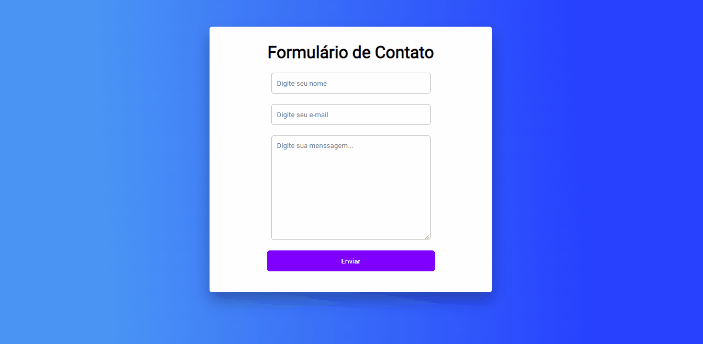

<h1 align="center">Formulário</h1> 

> ## 💻 Projeto
Este projeto é um formulário simples de contato. Nele o usuário pode colocar o seu nome, email e uma mensagem. As informações serão enviadas para um email de contato.

> ## 📸 Demo

> ## 🚀 Tecnologias e Ferramentas
* [HTML](https://developer.mozilla.org/pt-BR/docs/Web/HTML)
* [CSS](https://developer.mozilla.org/pt-BR/docs/Web/CSS)
* [Formsubmit](https://formsubmit.co/)
* [Google Fonts](https://fonts.google.com/)

> ## 📝 Licença
Esse projeta está sob a licença MIT. Veja o arquivo [LICENSE](https://github.com/W-Carlos/Formulario/blob/master/LICENSE) para mais detalhes.

---

Feito por 👋 Wend Carlos

